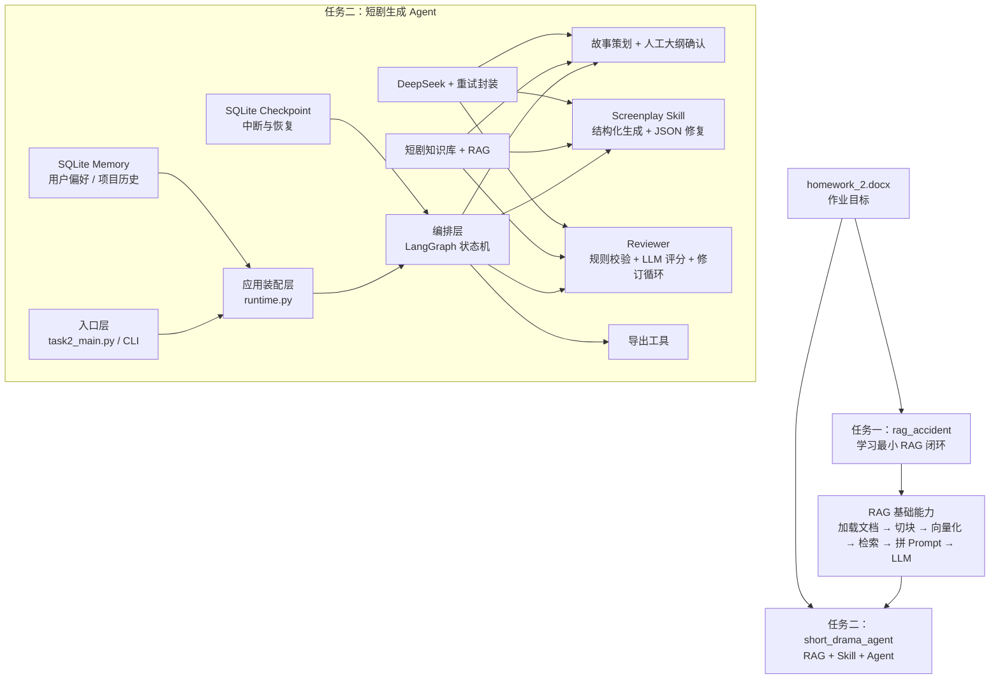
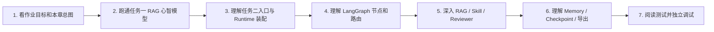
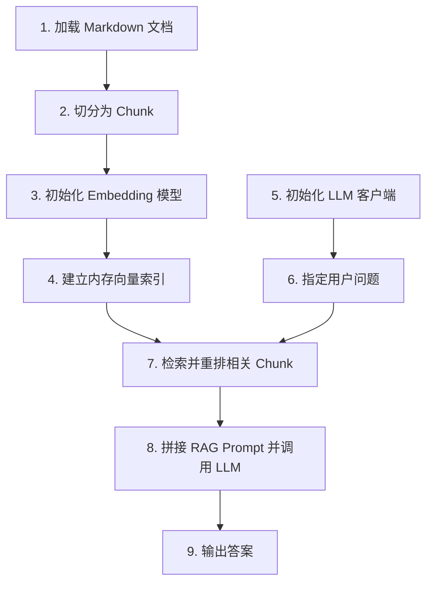
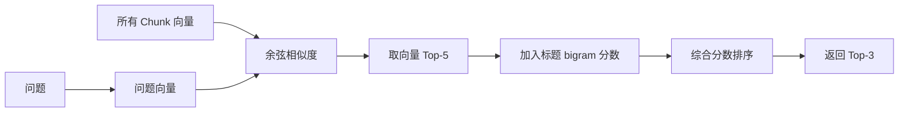
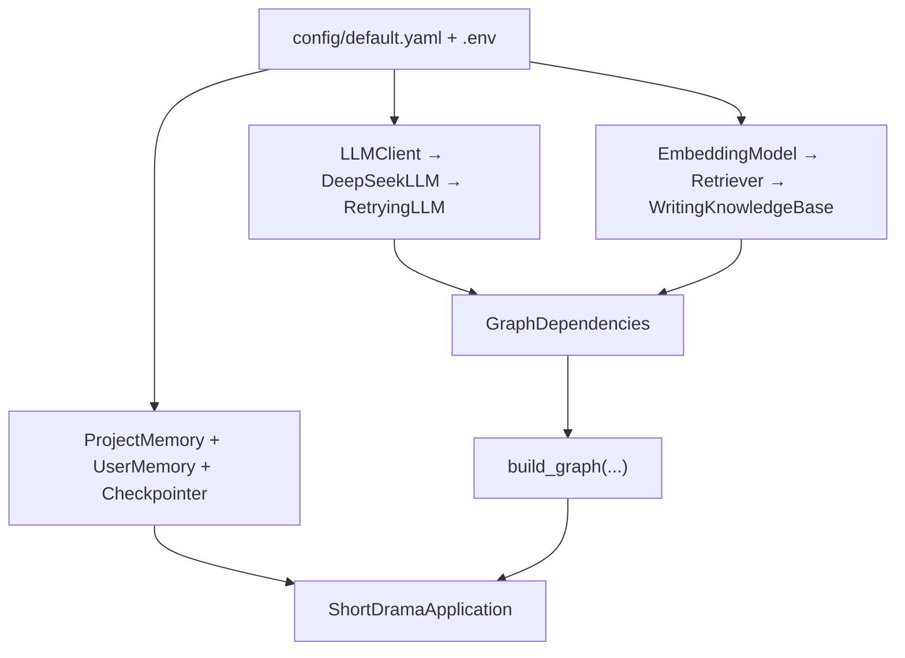
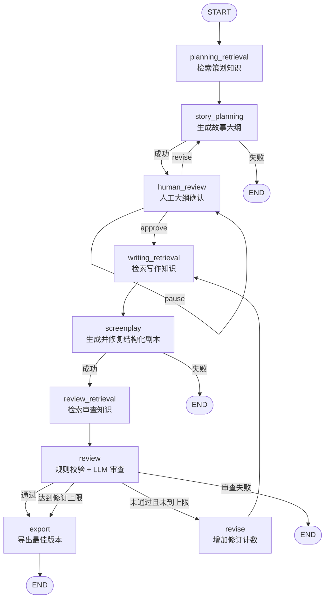
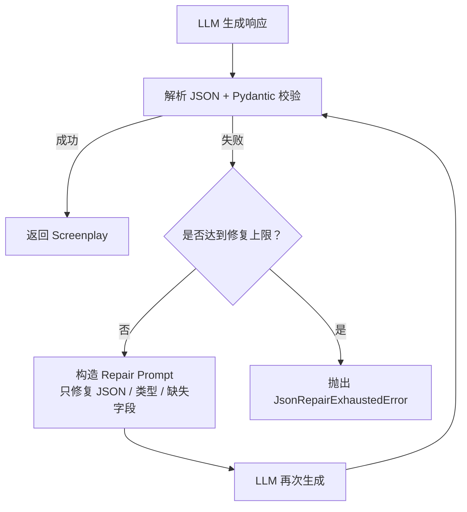
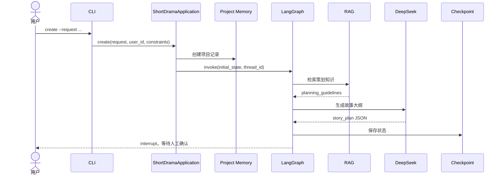
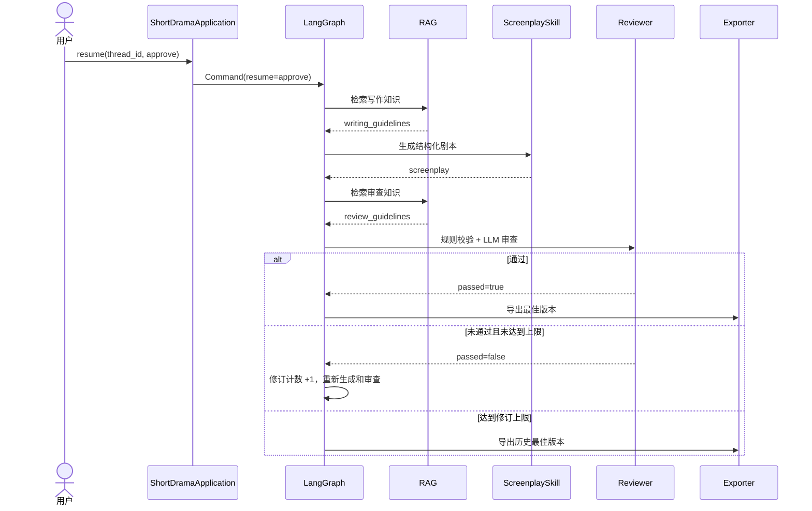

# 项目完整入门指南：从最小 RAG 到短剧生成 Agent

> 适合第一次接触本项目、RAG、结构化生成和 LangGraph 的读者。
>
> 本文以当前工作区代码为准。它不仅解释“项目想做什么”，也说明“代码现在实际怎么做”“哪些行为已经被测试验证”“哪些地方仍有风险”。

## 目录

1. [先看全局：这个项目到底是什么](#1-先看全局这个项目到底是什么)
2. [阅读前需要知道的核心概念](#2-阅读前需要知道的核心概念)
3. [项目目录地图](#3-项目目录地图)
4. [任务一：完整理解最小 RAG](#4-任务一完整理解最小-rag)
5. [任务二：完整理解短剧生成 Agent](#5-任务二完整理解短剧生成-agent)
6. [追踪一次完整运行](#6-追踪一次完整运行)
7. [核心数据结构与配置速查](#7-核心数据结构与配置速查)
8. [错误处理、恢复与持久化](#8-错误处理恢复与持久化)
9. [测试体系与验证边界](#9-测试体系与验证边界)
10. [当前实现审计](#10-当前实现审计)
11. [推荐源码阅读顺序](#11-推荐源码阅读顺序)
12. [调试方法与常用命令](#12-调试方法与常用命令)
13. [练习题与掌握检查清单](#13-练习题与掌握检查清单)

---

## 1. 先看全局：这个项目到底是什么

### 1.1 作业目标

根目录的 [`homework_2.docx`](homework_2.docx) 将作业拆成两个递进任务：

- **任务一：最小 RAG**  
  准备文档，将文档向量化，根据问题检索相关内容，把内容拼进 Prompt，再调用 LLM 回答问题。
- **任务二：短剧生成 Agent**  
  使用 RAG 提供短剧创作知识，使用 Skill 生成结构化剧本，再由 Agent 编排完整工作流。

因此，这个仓库不是两个互不相关的程序。正确的理解顺序是：

```text
先通过任务一理解 RAG 的最小闭环
                ↓
再观察任务二如何把 RAG 作为一种能力嵌入 Agent 工作流
```

### 1.2 总体架构图



### 1.3 两个子项目的关系

| 对比项 | `rag_accident` | `short_drama_agent` |
|---|---|---|
| 主要目的 | 演示和学习 RAG | 生成、审查、修订并导出短剧 |
| 用户输入 | 一个事故相关问题 | 一条短剧创作需求 |
| 知识库 | 3 篇高速追尾事故文档 | 4 篇短剧写作指导文档 |
| RAG 使用次数 | 一次 | 策划、写作、审查三个阶段 |
| LLM 任务 | 基于文档回答问题 | 生成大纲、生成剧本、审查剧本 |
| 工作流 | 线性脚本 | LangGraph 状态机 |
| 人工参与 | 无 | 大纲阶段可确认、修改或暂停 |
| 持久化 | 演示输出 | Checkpoint、Memory、项目产物 |
| 输出 | 控制台答案、图表、Chunk 文件 | 剧本、审查报告、检索轨迹、摘要 |

需要特别注意：任务二的 `src/rag/` 是一套独立代码，并不是运行时直接导入任务一的 `rag_accident/src/rag/`。两者保持相似公共接口，并由兼容性测试约束。

### 1.4 推荐学习路线



第一次阅读时，不建议从最长的 [`chunker.py`](short_drama_agent/src/rag/chunker.py) 开始。先理解系统为什么需要它，再阅读实现细节。

---

## 2. 阅读前需要知道的核心概念

### 2.1 LLM

LLM（Large Language Model，大语言模型）负责根据输入消息生成文本。本项目通过 OpenAI 兼容接口调用 DeepSeek。

LLM 擅长生成，但它有几个问题：

- 不知道项目私有文档中的内容；
- 可能产生听起来合理但实际错误的内容；
- 输出格式不一定稳定；
- 一次调用失败时需要重试或降级。

所以任务二没有让 LLM 完全自由控制程序，而是把它放入受控节点中。

### 2.2 Prompt

Prompt 是发送给 LLM 的指令和上下文。本项目中的 Prompt 通常包含：

- 系统角色和输出要求；
- 用户需求；
- RAG 检索出的知识；
- 结构化 Schema；
- 生成约束或审查规则。

同一个 LLM，在不同 Prompt 下承担不同角色：故事策划者、短剧编剧、质量审查员。

### 2.3 RAG

RAG 全称 Retrieval-Augmented Generation，即“检索增强生成”。

普通问答：

```text
问题 → LLM → 答案
```

RAG 问答：

```text
问题 → 从知识库检索相关内容 → 把内容与问题一起交给 LLM → 答案
```

RAG 的核心价值是让模型先看到指定知识，再进行生成。

### 2.4 Document 与 Chunk

- **Document**：完整文档及其元数据。
- **Chunk**：从文档中切出的较小片段。

为什么不直接检索整篇文档？

- 整篇文档可能包含多个主题；
- 用户问题通常只对应其中一部分；
- 无关内容会浪费上下文并干扰模型；
- 小片段更容易进行精确排序。

但 Chunk 也不能过小，否则会丢失完整语义。因此项目使用标题层级、最大长度、最小长度和重叠长度来平衡。

### 2.5 Embedding

Embedding 将文本转换为数值向量。语义接近的文本，其向量方向通常也更接近。

本项目使用：

```text
paraphrase-multilingual-MiniLM-L12-v2
```

它负责“检索相关内容”，不负责“生成答案”。Embedding 模型和 DeepSeek 的职责不同。

### 2.6 相似度、Top-K 与重排

检索器先计算问题向量与所有 Chunk 向量的余弦相似度，然后：

1. 按向量分数召回 `candidate_k` 个候选；
2. 使用标题匹配信号进行重排；
3. 返回最终 `top_k` 个结果。

当前最终分数：

```text
final_score = 0.85 × vector_score + 0.15 × title_score
```

### 2.7 Skill

本项目中的 Skill 不是任意工具集合，而是一个职责明确、可复用、可测试的能力模块。

`ScreenplaySkill` 的职责是：

```text
故事大纲 + 需求 + 约束 + 写作知识 + 用户偏好
                       ↓
              符合 Screenplay Schema 的剧本
```

如果 LLM 输出的 JSON 无法解析或不符合 Schema，Skill 会要求 LLM 只修复结构问题。

### 2.8 Agent 与 LangGraph

Agent 可以理解为：能够组合模型、工具、知识与状态，按流程完成目标的系统。

本项目并不是让 LLM 自由决定下一步，而是使用 LangGraph 定义一个确定性状态机：

- 每个节点做一件明确的事；
- 节点之间通过共享 `AgentState` 传递数据；
- 路由函数决定下一步；
- Checkpoint 保存中间状态；
- 人工可在大纲处中断和恢复。

### 2.9 State、Checkpoint 与 Memory

这三个概念容易混淆：

| 概念 | 保存什么 | 生命周期 | 当前存储方式 |
|---|---|---|---|
| `AgentState` | 当前工作流中的所有运行数据 | 一次工作流 | LangGraph State |
| Checkpoint | 节点执行后的状态快照 | 一个可恢复线程 | `checkpoints.sqlite` |
| Long-term Memory | 用户偏好与成功项目摘要 | 跨项目 | `memory.sqlite` |

Checkpoint 用于“从中断处继续”，Memory 用于“记住用户和历史”。两者不能互相替代。

---

## 3. 项目目录地图

### 3.1 根目录

```text
D:\baidu\task_2
├── homework_2.docx          # 原始作业要求
├── rag_accident/            # 任务一：最小 RAG
├── short_drama_agent/       # 任务二：短剧生成 Agent
└── PROJECT_GUIDE.md         # 本入门指南
```

### 3.2 任务一目录

```text
rag_accident/
├── mission1_main.py             # 主流程入口
├── config.py                    # LLM、Embedding、RAG 配置
├── src/
│   ├── rag/
│   │   ├── document_loader.py   # 加载 Markdown
│   │   ├── chunker.py           # 按标题和长度切块
│   │   ├── embedding.py         # SentenceTransformer 封装
│   │   └── retriever.py         # 向量检索与重排
│   └── llm/client.py            # DeepSeek/OpenAI 兼容客户端
├── rag_docs_accident/           # 3 篇事故知识文档
├── output/                      # 演示输出与可视化
├── rag_pipeline_demo.ipynb      # Notebook 演示
└── test_rag_enhancements.py     # RAG 增强测试
```

### 3.3 任务二目录

```text
short_drama_agent/
├── task2_main.py                # 极薄入口
├── config/default.yaml          # 默认配置
├── src/
│   ├── app/                     # CLI 与生产应用装配
│   ├── agent/                   # LangGraph、节点、路由、状态
│   ├── llm/                     # LLM 协议、DeepSeek 适配、重试
│   ├── rag/                     # 独立 RAG 基线与 Agent 适配层
│   ├── skills/screenplay/       # 结构化剧本生成 Skill
│   ├── evaluation/              # 审查、评分和最佳版本选择
│   ├── memory/                  # 用户偏好与项目历史仓库
│   └── tools/                   # 检索、Memory、导出工具
├── rag_docs_short_drama/        # 4 篇短剧创作知识
├── tests/                       # 离线单元与流程测试
├── data/                        # SQLite 数据库，运行时生成
└── output/projects/             # 最终项目产物，运行时生成
```

### 3.4 分层职责

| 层 | 主要目录 | 回答的问题 |
|---|---|---|
| 入口层 | `task2_main.py`, `src/app/cli.py` | 用户输入了什么命令？ |
| 装配层 | `src/app/runtime.py` | 生产环境需要哪些对象？如何连接？ |
| 编排层 | `src/agent/` | 下一步执行哪个节点？状态如何流转？ |
| 能力层 | `src/rag/`, `src/skills/`, `src/evaluation/` | 如何检索、生成和审查？ |
| 基础设施层 | `src/llm/`, `src/memory/`, `src/tools/` | 如何调用模型、持久化和导出？ |

---

## 4. 任务一：完整理解最小 RAG

### 4.1 从入口开始

任务一入口是 [`mission1_main.py`](rag_accident/mission1_main.py)。

它的 `main()` 按顺序完成九件事：



指定问题是：

```text
什么是高速追尾事故？
```

### 4.2 配置如何进入程序

[`config.py`](rag_accident/config.py) 提供四类配置：

| 配置 | 当前值 | 作用 |
|---|---|---|
| `llm.base_url` | `https://api.deepseek.com` | DeepSeek API 地址 |
| `llm.model` | `deepseek-chat` | 使用的模型 |
| `embedding.model_name` | `paraphrase-multilingual-MiniLM-L12-v2` | 文本向量模型 |
| `rag.chunk_size` | `500` | Chunk 最大字符数 |
| `rag.chunk_overlap` | `50` | 长文本切分时的重叠字符数 |
| `rag.candidate_k` | `5` | 第一阶段候选数量 |
| `rag.top_k` | `3` | 最终传给 LLM 的片段数量 |

API Key 从环境变量 `DEEPSEEK_API_KEY` 读取，而不是写死在代码中。

### 4.3 文档加载

关键源码：[`document_loader.py`](rag_accident/src/rag/document_loader.py)

输入：

```text
rag_docs_accident/
```

处理：

1. 检查目录是否存在；
2. 找到并排序所有 `*.md`；
3. 使用 UTF-8 读取；
4. 创建 `Document(content, metadata)`。

输出中的元数据包括：

```python
{
    "source": "rag_docs_accident/xxx.md",
    "filename": "xxx.md",
}
```

元数据让后续结果可以追溯到来源。

### 4.4 文档切块

关键源码：[`chunker.py`](rag_accident/src/rag/chunker.py)

切块不是简单地每 500 个字符截断。当前策略是：

1. 优先按 Markdown 二级标题 `##` 切分；
2. 如果二级标题下内容过长，再按三级标题 `###` 切分；
3. 清理边界；
4. 合并过小且属于同一标题的片段；
5. 仍然过长时，再按字符长度切分并保留 overlap。

每个 Chunk 保存：

```python
Chunk(
    text="片段正文",
    source="来源路径",
    metadata={
        "document_title": "一级标题",
        "parent_header": "父级标题",
        "current_header": "当前标题",
        ...
    },
)
```

标题层级既用于解释来源，也用于增强检索。

### 4.5 文本向量化

关键源码：[`embedding.py`](rag_accident/src/rag/embedding.py)

`EmbeddingModel` 封装 `SentenceTransformer`，提供两个接口：

```python
encode(texts)          # 批量文本 → 二维向量数组
encode_single(text)    # 单个文本 → 一维向量
```

建立索引时，程序不是只向量化 Chunk 正文，而是拼接：

```text
文档标题
父标题
当前标题
Chunk 正文
```

这样即使正文没有重复主题词，标题也能帮助表达语义。

### 4.6 建立索引

关键源码：[`retriever.py`](rag_accident/src/rag/retriever.py)

`Retriever.index(chunks)`：

1. 保存原始 Chunk；
2. 为每个 Chunk 构造增强后的向量化文本；
3. 批量生成向量；
4. 将向量保存在内存中的 NumPy 数组。

这里没有使用 FAISS、Milvus 或 Chroma。因为知识库很小，直接使用 NumPy 足够演示原理。

### 4.7 检索与重排

`Retriever.query(question, candidate_k=5, top_k=3)` 的过程：



三个分数：

- `vector_score`：问题与 Chunk 的整体语义相似度；
- `title_score`：问题与标题的字符二元组匹配比例；
- `final_score`：两者加权结果。

这是一种轻量级混合检索：以语义向量为主，以标题关键词为辅。

### 4.8 构造 Prompt 并调用 LLM

`build_rag_prompt()` 将 Top-3 结果拼成上下文，要求模型只根据文档回答。

大致结构：

```text
请根据以下文档内容回答问题。

【文档片段1】
...

【文档片段2】
...

问题：什么是高速追尾事故？

请仅根据文档内容回答；如果文档中没有相关信息，请说明。
```

[`src/llm/client.py`](rag_accident/src/llm/client.py) 使用 OpenAI Python 客户端访问 DeepSeek 兼容接口。

### 4.9 如何判断任务一哪里出错

如果最终答案不好，不要立刻认为是 LLM 不行。按顺序检查：

1. 知识库中是否真的有答案；
2. 文档是否正确读取；
3. 相关内容是否被合理切块；
4. 相关 Chunk 是否出现在候选 Top-5；
5. 相关 Chunk 是否进入最终 Top-3；
6. Prompt 是否包含正确内容；
7. LLM 是否遵守 Prompt。

这个顺序把“检索错误”和“生成错误”分开，是调试 RAG 的关键。

### 4.10 任务一学完后应掌握什么

你应能独立解释：

- 为什么要切块；
- Embedding 与 LLM 有什么区别；
- 向量相似度如何用于语义检索；
- `candidate_k` 与 `top_k` 为什么不同；
- 为什么检索结果必须放入 Prompt；
- 标题层级为什么能改善检索；
- 如何判断错误发生在检索阶段还是生成阶段。

---

## 5. 任务二：完整理解短剧生成 Agent

### 5.1 它解决什么问题

用户输入一条短剧需求后，系统需要：

1. 检索策划知识；
2. 生成故事大纲；
3. 暂停并等待用户确认；
4. 检索写作知识；
5. 生成符合固定结构的剧本；
6. 检索审查知识；
7. 审查剧本并决定是否修订；
8. 导出最佳版本；
9. 保存可恢复状态、用户偏好和项目历史。

这已经不是一条简单的 LLM 调用，而是一条有状态、有分支、有循环、有人工中断的工作流。

### 5.2 入口层：CLI

最外层入口 [`task2_main.py`](short_drama_agent/task2_main.py) 只负责调用 `src.app.cli.main()`。

真正的命令定义在 [`src/app/cli.py`](short_drama_agent/src/app/cli.py)：

| 命令 | 用途 | 关键输入 |
|---|---|---|
| `create` | 创建新短剧项目 | `--request`, 时长和场景约束 |
| `resume` | 恢复已暂停流程 | `--thread-id`, `--action`, 反馈、显式偏好 |
| `history` | 查看用户成功项目历史 | `--user-id` |

CLI 只做三类工作：

1. 解析命令行参数；
2. 转换成应用层需要的数据；
3. 格式化应用返回结果。

它不应该知道 LangGraph 内部有多少节点，也不应该直接调用 DeepSeek。

### 5.3 应用装配层：Runtime

关键源码：[`src/app/runtime.py`](short_drama_agent/src/app/runtime.py)

`build_production_app(config)` 是整个生产应用的装配中心。它创建并连接：



这一层体现了依赖注入：

- Graph 不自行创建 LLM；
- 节点不自行创建数据库；
- Reviewer、Skill 和 Retriever 都由 Runtime 创建后注入；
- 测试可以替换成假实现，不访问网络。

### 5.4 LLM 分层与重试

相关源码：

- [`src/llm/base.py`](short_drama_agent/src/llm/base.py)
- [`src/llm/client.py`](short_drama_agent/src/llm/client.py)
- [`src/llm/deepseek.py`](short_drama_agent/src/llm/deepseek.py)
- [`src/llm/retrying.py`](short_drama_agent/src/llm/retrying.py)

调用链：

```text
业务能力调用 LLM.generate(...)
        ↓
RetryingLLM：失败时指数退避重试
        ↓
DeepSeekLLM：将统一 generate 接口适配为 client.chat
        ↓
LLMClient：调用 OpenAI 兼容 API
        ↓
DeepSeek
```

`LLM` 使用 `Protocol` 定义统一接口，因此测试中的假 LLM 只要实现 `generate()` 就可替代真实模型。

重试默认参数：

```yaml
max_attempts: 3
initial_delay_seconds: 1.0
backoff_multiplier: 2.0
```

即失败后的等待时间依次为 1 秒、2 秒，然后耗尽尝试并抛出类型化异常。

### 5.5 LangGraph 状态机

相关源码：

- [`src/agent/state.py`](short_drama_agent/src/agent/state.py)
- [`src/agent/graph.py`](short_drama_agent/src/agent/graph.py)
- [`src/agent/nodes.py`](short_drama_agent/src/agent/nodes.py)
- [`src/agent/router.py`](short_drama_agent/src/agent/router.py)

完整图：



#### 为什么使用状态机

如果把所有逻辑写在一个函数里，会出现：

- 分支和循环难以理解；
- 很难在中途暂停；
- 很难保存和恢复；
- 节点难以单独测试；
- 失败时不知道处于哪一步。

LangGraph 把每一步显式化，让流程可观察、可路由、可恢复。

### 5.6 AgentState：工作流的共享数据

`AgentState` 是一个 `TypedDict`，其中包含：

- 身份：`project_id`, `thread_id`, `user_id`；
- 输入：`user_request`, `requirement`, `constraints`；
- 用户数据：`user_preferences`, `user_feedback`；
- 三阶段 RAG：`planning_guidelines`, `writing_guidelines`, `review_guidelines`；
- 中间产物：`story_plan`, `screenplay`, `review_report`；
- 最佳版本：`best_screenplay`, `best_review_report`；
- 计数：`json_repair_count`, `content_revision_count`；
- 输出：最终文件路径；
- 错误：`errors`。

节点读取当前 State，并返回需要更新的字段。LangGraph 合并更新后再传给下一节点。

### 5.7 三阶段 RAG

任务二不是只在开始检索一次，而是在三个阶段生成不同查询：

| 阶段 | Query 目标 | 写入 State |
|---|---|---|
| 策划前 | 开头钩子、人物目标、核心冲突、反转设计 | `planning_guidelines` |
| 写作前 | 场景节奏、视觉动作、对白、低成本可拍性 | `writing_guidelines` |
| 审查前 | 结构、节奏、人物一致性、可拍性评价标准 | `review_guidelines` |

查询构造位于 [`src/rag/query_builder.py`](short_drama_agent/src/rag/query_builder.py)。

Agent 适配层 [`WritingKnowledgeBase`](short_drama_agent/src/rag/knowledge_base.py) 在基础 Retriever 之上增加：

- `purpose`：说明结果用于策划、写作还是审查；
- 稳定 `chunk_id`：由来源、标题层级和文本计算 SHA-256；
- 参数校验：例如 `top_k` 不能大于 `candidate_k`；
- Pydantic 输出模型 `RetrievedGuideline`。

稳定 ID 不依赖当前查询，因此同一知识片段可以被可靠追踪和去重。

### 5.8 Story Planner：生成故事大纲

Runtime 中的 `_StoryPlanner` 接收 State，向 LLM 提供：

- 原始需求；
- 用户反馈；
- 策划阶段检索知识；
- 已保存的用户偏好。

它要求 LLM 只输出 JSON 对象，然后解析成 Python 字典并写入 `story_plan`。

注意：故事大纲目前没有独立 Pydantic Schema，因此其结构约束弱于最终剧本。

### 5.9 人工确认与中断恢复

`human_review_node()` 使用 LangGraph 的 `interrupt()` 暂停流程，并向外部返回当前故事大纲。

用户之后可使用同一个 `thread_id`：

```text
approve → 接受大纲，继续生成剧本
revise  → 带反馈重新生成大纲
pause   → 保持暂停，稍后继续
```

`thread_id` 是恢复工作流的关键标识。没有它，系统无法知道应该恢复哪个 Checkpoint。

### 5.10 Screenplay Skill：结构化剧本生成

相关源码：

- [`src/skills/screenplay/schemas.py`](short_drama_agent/src/skills/screenplay/schemas.py)
- [`src/skills/screenplay/prompts.py`](short_drama_agent/src/skills/screenplay/prompts.py)
- [`src/skills/screenplay/repair.py`](short_drama_agent/src/skills/screenplay/repair.py)
- [`src/skills/screenplay/skill.py`](short_drama_agent/src/skills/screenplay/skill.py)

#### 输入

- `story_plan`
- `requirement`
- `GenerationConstraints`
- `writing_guidelines`
- `user_preferences`

#### 输出

```python
ScreenplaySkillResult(
    screenplay=Screenplay(...),
    json_repair_attempts=...,
)
```

#### 为什么需要 Schema

如果只让 LLM 自由写文本，后续很难可靠地：

- 计算场景数量和时长；
- 检查人物引用；
- 自动审查；
- 导出 JSON；
- 在程序中继续处理。

Pydantic `Screenplay` 将剧本约束为确定字段，包括标题、类型、主题、角色、场景、对白、反转和结局。

#### JSON Repair



JSON Repair 只负责修复格式和结构，不应该主动改写剧情质量。剧情质量由 Reviewer 和修订循环处理。

### 5.11 确定性剧本校验

`validate_screenplay()` 不依赖 LLM，直接检查：

- 总时长是否在范围内；
- 场景数量是否在范围内；
- 对白角色是否存在于角色列表；
- `scene_id` 是否从 1 开始连续递增；
- 是否存在开头钩子和至少一个场景结尾钩子；
- 是否存在明确反转。

这种规则检查稳定、便宜、可测试。适合确定性规则的事情，不应全部交给 LLM 判断。

### 5.12 Reviewer：规则校验 + LLM 审查

相关源码：

- [`src/evaluation/rubric.py`](short_drama_agent/src/evaluation/rubric.py)
- [`src/evaluation/reviewer.py`](short_drama_agent/src/evaluation/reviewer.py)
- [`src/evaluation/schemas.py`](short_drama_agent/src/evaluation/schemas.py)

Reviewer 同时使用两种判断：

1. **确定性校验**：时长、场景、角色、ID、钩子、反转；
2. **LLM 评分**：结构、人物一致性、冲突、对白、节奏、可拍性、RAG 遵循度、Schema 有效性。

只有同时满足以下条件才通过：

```text
total_score >= pass_score
并且
deterministic_errors 为空
```

Reviewer 还会归一化 LLM 的常见输出差异，例如：

- 评分字段使用简写；
- 使用五分制而不是十分制；
- `revision_instructions` 返回单个字符串；
- 总分被错误写成各项之和。

### 5.13 修订循环与最佳版本

如果审查未通过，并且没有达到最大修订次数：

```text
review → revise → writing_retrieval → screenplay → review_retrieval → review
```

每次审查后，`choose_best()` 比较当前候选与历史最佳版本：

1. 优先选择总分更高的；
2. 同分时选择确定性错误更少的。

达到修订上限时，系统导出最佳版本，而不是盲目导出最后一版。

### 5.14 Memory

相关源码：

- [`src/memory/user_memory.py`](short_drama_agent/src/memory/user_memory.py)
- [`src/memory/project_memory.py`](short_drama_agent/src/memory/project_memory.py)
- [`src/tools/memory.py`](short_drama_agent/src/tools/memory.py)

`memory.sqlite` 中保存两类长期信息：

#### 用户偏好

```text
preferred_genres
preferred_tones
preferred_endings
dialogue_style
production_constraints
```

系统只在用户通过 `resume --action revise` 显式提供偏好参数时更新偏好，不从普通自然语言反馈中擅自推断。

#### 项目历史

新建项目时保存基本记录；成功导出后保存：

- 标题；
- 类型；
- 一句话梗概；
- 用户反馈；
- 最终评分；
- 输出路径。

### 5.15 导出

关键源码：[`src/tools/export.py`](short_drama_agent/src/tools/export.py)

成功项目输出到：

```text
output/projects/<project_id>/
├── screenplay.json          # 结构化剧本
├── screenplay.md            # 人类可读剧本
├── review.json              # 审查报告
├── retrieval_trace.json     # 三阶段检索轨迹
└── summary.json             # 项目摘要
```

导出后，项目摘要也写入长期 Memory，供 `history` 查询。

---

## 6. 追踪一次完整运行

### 6.1 创建项目

用户执行：

```powershell
cd short_drama_agent
python task2_main.py create --request "创作一部校园悬疑短剧"
```

调用链：



`create()` 会生成两个不同 ID：

- `project_id`：标识最终项目及导出目录；
- `thread_id`：标识可恢复工作流。

### 6.2 确认大纲并恢复

```powershell
python task2_main.py resume --thread-id <thread-id> --action approve
```

继续调用链：



### 6.3 修改大纲并记录显式偏好

```powershell
python task2_main.py resume `
  --thread-id <thread-id> `
  --action revise `
  --feedback "加强结尾反转" `
  --preferred-genre "悬疑" `
  --preferred-ending "反转"
```

这里发生两件不同的事：

- `feedback` 进入当前工作流，影响下一次故事策划；
- 显式偏好写入长期 Memory，未来项目也可读取。

普通反馈不会自动被推断成长期偏好。

---

## 7. 核心数据结构与配置速查

### 7.1 `GenerationConstraints`

默认值来自 [`config/default.yaml`](short_drama_agent/config/default.yaml)：

| 参数 | 默认值 | 作用 |
|---|---:|---|
| `target_duration_seconds` | 240 | 目标时长 |
| `min_duration_seconds` | 180 | 最小时长 |
| `max_duration_seconds` | 300 | 最大时长 |
| `target_scene_count` | 4 | 目标场景数 |
| `min_scene_count` | 3 | 最少场景数 |
| `max_scene_count` | 6 | 最多场景数 |
| `max_json_repair_attempts` | 2 | JSON 修复上限 |
| `max_content_revisions` | 2 | 内容修订上限 |
| `pass_score` | 8.0 | 审查通过分数 |

时长和场景数量属于一次运行的约束，不是 `Screenplay` Schema 中永远固定的常量。

### 7.2 `Screenplay`

```text
Screenplay
├── title / genre / logline / theme
├── opening_hook / main_conflict / reversal / emotional_payoff
├── characters[]
│   └── name / role / personality / goal
├── scenes[]
│   ├── scene_id / location / time / purpose / conflict
│   ├── visual_action / estimated_seconds
│   ├── dialogues[]
│   │   └── character / line / emotion
│   └── ending_hook / shooting_note
└── ending
```

### 7.3 `RetrievedGuideline`

每条 Agent RAG 结果包含：

```text
稳定 chunk_id
用途 purpose
查询 query
正文 text
来源 source
标题层级
vector_score / title_score / final_score
```

因此导出的 `retrieval_trace.json` 不只是文本，也保留了为什么召回它的证据。

### 7.4 `ReviewReport`

审查报告包括：

- 八个维度评分；
- 总分；
- 问题列表；
- 修订指令；
- 摘要；
- 确定性错误；
- 是否通过。

### 7.5 配置加载优先级

[`src/config.py`](short_drama_agent/src/config.py) 先读取 YAML，再用环境变量 `DEEPSEEK_API_KEY` 覆盖或补充 LLM 配置。

```text
config/default.yaml
        +
.env / 环境变量中的 DEEPSEEK_API_KEY
        ↓
最终生产配置
```

---

## 8. 错误处理、恢复与持久化

### 8.1 可恢复与不可恢复错误

RAG 检索节点失败时：

- 错误记录进 `state["errors"]`；
- 标记 `recoverable: true`；
- 对应指南设为空列表；
- 工作流降级继续。

原因是没有指南时，模型仍可能完成策划、写作或审查。

故事策划、审查、导出等关键节点失败时：

- `safe_state_node()` 记录错误；
- 标记 `recoverable: false`；
- 路由通常停止流程。

剧本生成失败时由 `screenplay_node()` 单独记录，并在没有剧本时停止。

### 8.2 LLM 重试与 JSON Repair 的区别

| 机制 | 处理的问题 | 发生位置 |
|---|---|---|
| `RetryingLLM` | API 异常、网络异常、模型调用抛错 | 所有 LLM 调用外层 |
| JSON Repair | 模型成功返回，但 JSON 无效或不符合 Schema | `ScreenplaySkill` 内部 |
| Content Revision | 剧本格式有效，但内容质量未通过 | LangGraph 审查循环 |

三者解决不同问题，不应混为一谈。

### 8.3 Checkpoint

`sqlite_checkpointer()` 创建 LangGraph SQLite Checkpointer，并保存到：

```text
data/checkpoints.sqlite
```

它支持：

- 大纲确认处暂停；
- 使用 `thread_id` 恢复；
- 保留失败前的状态；
- 跨进程继续同一个工作流。

### 8.4 Long-term Memory

长期 Memory 使用：

```text
data/memory.sqlite
```

它不保存完整工作流状态，只保存高价值长期信息。这样避免把模型的临时推断和失败状态误当作用户真实偏好。

---

## 9. 测试体系与验证边界

### 9.1 当前已验证结果

在当前工作区执行离线测试：

```powershell
cd rag_accident
python -m unittest test_rag_enhancements.py -v
```

结果：

```text
Ran 3 tests
OK
```

任务二：

```powershell
cd short_drama_agent
python -m unittest discover -s tests -v
```

结果：

```text
Ran 66 tests
OK
```

### 9.2 测试覆盖了什么

| 测试区域 | 主要验证内容 |
|---|---|
| RAG 基线 | 标题层级、切块边界、混合分数 |
| 配置与 LLM | 环境变量覆盖、适配器、指数退避重试 |
| WritingKnowledgeBase | 稳定 ID、参数转发、查询构造 |
| Schema | 场景、角色、约束和确定性规则 |
| JSON Repair | Markdown 代码块、修复计数、耗尽异常 |
| Screenplay Skill | Prompt、首次成功、修复限制 |
| Reviewer | 分数归一化、通过规则、最佳版本 |
| Graph Routing | 路由、错误降级、修订上限 |
| Graph Flow | 中断恢复、三阶段 RAG、失败停止、导出 |
| Memory | 项目记录、显式偏好、成功摘要 |
| CLI | create、resume、history 参数传递 |
| Export | 五类产物是否写出 |

### 9.3 测试没有证明什么

当前测试大量使用假 LLM、假 Embedding、临时数据库和记录型依赖，因此测试通过不等于：

- 真实 DeepSeek API Key 有效；
- 网络调用一定成功；
- DeepSeek 总能生成符合预期的故事大纲；
- 真实 SentenceTransformer 模型一定能在当前机器下载或加载；
- 真实端到端输出质量达到业务标准；
- Windows 终端一定能正确显示中文。

测试证明的是模块合同和离线流程行为，而不是生产环境质量。

---

## 10. 当前实现审计

### 10.1 做得较好的设计

#### 1. 从最小 RAG 逐步扩展

任务一先展示 RAG 原理，任务二保留相似接口并增加 Agent 适配层。学习路径清晰。

#### 2. 工作流是显式状态机

节点、路由、循环、中断和恢复都能被单独理解与测试，比让 LLM 自由决定流程更可靠。

#### 3. 依赖注入使离线测试可行

Graph、Skill 和 Reviewer 依赖统一接口，测试能替换假 LLM、假 Retriever 和假 Exporter。

#### 4. 确定性规则与 LLM 评分分离

可确定检查的事情交给代码，主观质量交给 LLM，降低了完全依赖模型判断的风险。

#### 5. 三种“修复”职责分离

API 重试、JSON Repair、内容修订解决不同问题，边界明确。

#### 6. Memory 写入较克制

只保存显式偏好和成功项目摘要，避免模型自行推断污染长期记忆。

### 10.2 当前风险与限制

#### 1. 当前内容修订不是定向改稿

`revise_node()` 目前只增加 `content_revision_count`。重新生成时会再次检索和生成，但生成 Prompt 没有直接包含上一版剧本、当前审查报告或 `revision_instructions`。

因此当前修订循环更接近“在相同上下文下重新生成并重新评分”，而不是“根据审查意见修改上一版剧本”。这是当前最重要的能力限制。

#### 2. 故事大纲缺少强 Schema

`_StoryPlanner` 只要求返回 JSON 字典，没有使用独立 Pydantic 模型校验字段。大纲字段缺失或形状变化可能在后续查询构造或生成阶段暴露。

#### 3. 真实 LLM 输出仍有不确定性

Reviewer 已对常见评分格式进行归一化，但 `_StoryPlanner` 的 JSON 解析没有类似 Repair 流程；真实模型输出 Markdown 包裹或无效 JSON 时可能停止。

#### 4. RAG 索引每次生产应用启动时重建

`build_production_app()` 会初始化 Embedding 模型、加载知识文档并重新建立内存索引。知识库很小时可以接受，但启动成本会随着规模增长。

#### 5. 没有独立向量数据库

当前向量保存在内存 NumPy 数组中，适合教学和小型知识库，不适合大规模、多租户或频繁更新场景。

#### 6. 配置校验较弱

YAML 被读取为普通字典。除了各模块局部校验外，没有统一配置 Schema 提前检查缺失字段、类型错误和路径错误。

#### 7. 真实端到端运行尚未由当前离线测试证明

需要单独验证真实 API、模型下载、中文输出、SQLite 持久化和完整 create/resume 流程。

### 10.3 PowerShell 中文乱码说明

如果在 PowerShell 使用 `Get-Content` 看到类似 `鐭墽` 的乱码，不一定代表文件损坏。当前文件使用 UTF-8，乱码主要来自终端读取或显示编码不一致。

可使用 Python 明确指定 UTF-8 检查：

```powershell
python -c "from pathlib import Path; print(Path('short_drama_agent/README.md').read_text(encoding='utf-8')[:200])"
```

### 10.4 建议改进优先级

1. **让内容修订真正消费上一版剧本和审查意见。**
2. **为 Story Plan 增加 Pydantic Schema 和 JSON Repair。**
3. **增加真实 DeepSeek 的可选端到端冒烟测试。**
4. **为整体配置增加 Pydantic 校验。**
5. **缓存 Embedding 模型和已构建索引。**
6. **知识库扩大后再考虑向量数据库。**

---

## 11. 推荐源码阅读顺序

### 第一轮：只建立全局模型

1. [`homework_2.docx`](homework_2.docx)
2. [`rag_accident/mission1_main.py`](rag_accident/mission1_main.py)
3. [`short_drama_agent/task2_main.py`](short_drama_agent/task2_main.py)
4. [`short_drama_agent/src/app/cli.py`](short_drama_agent/src/app/cli.py)
5. [`short_drama_agent/src/app/runtime.py`](short_drama_agent/src/app/runtime.py)
6. [`short_drama_agent/src/agent/graph.py`](short_drama_agent/src/agent/graph.py)

目标：能画出从用户命令到最终输出的主流程。

### 第二轮：理解任务一 RAG

1. [`document_loader.py`](rag_accident/src/rag/document_loader.py)
2. [`chunker.py`](rag_accident/src/rag/chunker.py)
3. [`embedding.py`](rag_accident/src/rag/embedding.py)
4. [`retriever.py`](rag_accident/src/rag/retriever.py)
5. [`test_rag_enhancements.py`](rag_accident/test_rag_enhancements.py)

目标：能解释一个问题如何变成 Top-3 Chunk。

### 第三轮：理解任务二能力模块

1. [`src/agent/state.py`](short_drama_agent/src/agent/state.py)
2. [`src/agent/nodes.py`](short_drama_agent/src/agent/nodes.py)
3. [`src/agent/router.py`](short_drama_agent/src/agent/router.py)
4. [`src/rag/knowledge_base.py`](short_drama_agent/src/rag/knowledge_base.py)
5. [`src/skills/screenplay/skill.py`](short_drama_agent/src/skills/screenplay/skill.py)
6. [`src/skills/screenplay/schemas.py`](short_drama_agent/src/skills/screenplay/schemas.py)
7. [`src/evaluation/reviewer.py`](short_drama_agent/src/evaluation/reviewer.py)

目标：能解释节点如何读取和更新 State。

### 第四轮：通过测试确认理解

优先阅读：

1. [`tests/test_graph_flow.py`](short_drama_agent/tests/test_graph_flow.py)
2. [`tests/test_graph_routing.py`](short_drama_agent/tests/test_graph_routing.py)
3. [`tests/test_screenplay_skill.py`](short_drama_agent/tests/test_screenplay_skill.py)
4. [`tests/test_reviewer.py`](short_drama_agent/tests/test_reviewer.py)
5. [`tests/test_runtime_memory.py`](short_drama_agent/tests/test_runtime_memory.py)

测试通常比实现代码更直接地表达“系统承诺什么行为”。

---

## 12. 调试方法与常用命令

### 12.1 安装依赖

任务一和任务二分别有自己的依赖文件：

```powershell
cd rag_accident
python -m pip install -r requirements.txt

cd ..\short_drama_agent
python -m pip install -r requirements.txt
```

### 12.2 配置 API Key

在根目录或当前运行目录可被 `python-dotenv` 找到的 `.env` 中配置：

```text
DEEPSEEK_API_KEY=your-api-key
```

不要将真实 Key 提交到 Git。

### 12.3 运行任务一

```powershell
cd rag_accident
python mission1_main.py
```

建议观察：

- 加载了多少文档；
- 产生多少 Chunk；
- Top-3 的三个分数；
- 最终答案是否能追溯到知识文档。

### 12.4 运行任务二

创建项目：

```powershell
cd short_drama_agent
python task2_main.py create --request "创作一部校园悬疑短剧"
```

恢复并确认：

```powershell
python task2_main.py resume --thread-id <thread-id> --action approve
```

修改大纲：

```powershell
python task2_main.py resume `
  --thread-id <thread-id> `
  --action revise `
  --feedback "加强结尾反转"
```

查看历史：

```powershell
python task2_main.py history --user-id default
```

### 12.5 离线测试

```powershell
cd rag_accident
python -m unittest test_rag_enhancements.py -v

cd ..\short_drama_agent
python -m unittest discover -s tests -v
python -m compileall src task2_main.py
python task2_main.py --help
```

### 12.6 调试一个失败项目

建议按以下顺序检查：

1. CLI 是否把参数正确传给 Application；
2. `thread_id` 是否正确；
3. State 中关键字段是否存在；
4. `errors` 列表记录了哪个节点；
5. 三阶段 RAG 是否返回内容；
6. JSON Repair 次数是否耗尽；
7. Reviewer 的确定性错误和 LLM 评分分别是什么；
8. 是否达到内容修订上限；
9. Checkpoint 和 Memory 数据库是否存在；
10. 输出目录是否生成五类文件。

### 12.7 调试时最值得打印的字段

```text
project_id
thread_id
story_plan
planning_guidelines / writing_guidelines / review_guidelines
screenplay
review_report
best_review_report
json_repair_count
content_revision_count
errors
final_json_path / final_markdown_path
```

不要只打印最终剧本。中间状态才是判断失败位置的关键。

---

## 13. 练习题与掌握检查清单

### 13.1 基础理解题

1. 为什么任务一需要先切块，再进行 Embedding？
2. Embedding 模型和 DeepSeek 分别负责什么？
3. `candidate_k=5` 与 `top_k=3` 有什么区别？
4. 为什么最终分数还加入标题匹配分数？
5. 为什么任务二要在策划、写作和审查前分别检索？
6. 为什么 `Screenplay` 使用 Pydantic Schema？
7. JSON Repair 和 Content Revision 有什么区别？
8. Checkpoint 和 Long-term Memory 有什么区别？
9. 为什么达到修订上限后导出最佳版本，而不是最后版本？
10. 为什么普通用户反馈不会自动写入长期偏好？

### 13.2 源码追踪练习

#### 练习一：追踪 `create`

从 CLI 开始，找出：

```text
参数解析 → Application.create → 初始 State → Graph.invoke → 人工中断
```

#### 练习二：追踪一条 RAG 结果

找出它如何经历：

```text
Markdown 文档 → Document → Chunk → Embedding → RetrievalResult
→ RetrievedGuideline → AgentState → retrieval_trace.json
```

#### 练习三：追踪一次失败

让假 Skill 抛出错误，观察：

- 哪个节点捕获；
- `errors` 如何记录；
- 路由为何停止；
- Checkpoint 是否仍保留状态。

#### 练习四：理解当前修订限制

阅读 `revise_node()`、`screenplay_node()` 和生成 Prompt，回答：

> Reviewer 的 `revision_instructions` 当前是否真的传入了下一轮剧本生成？

答案是否定的。这也是理解“测试通过不代表功能已经完整”的重要练习。

### 13.3 掌握检查清单

当你能完成以下事项时，就已经真正看懂了项目：

- [ ] 能用自己的话解释两个子项目为什么存在以及如何关联。
- [ ] 能画出任务一的 RAG 数据流。
- [ ] 能解释 Document、Chunk、Embedding 和 Retriever。
- [ ] 能解释任务二的五层架构。
- [ ] 能画出 LangGraph 主流程和两个循环。
- [ ] 能说明每个核心节点读写哪些 State 字段。
- [ ] 能解释三阶段 RAG 的不同目标。
- [ ] 能解释 Screenplay Skill、Schema 和 JSON Repair。
- [ ] 能解释 Reviewer 如何决定通过和选择最佳版本。
- [ ] 能区分 Checkpoint、项目历史和用户偏好。
- [ ] 能独立运行离线测试并定位失败模块。
- [ ] 能指出当前内容修订循环的主要限制。
- [ ] 能说明哪些行为已被测试验证，哪些仍需真实环境验证。

---

## 结语

理解这个项目的关键，不是记住每个文件，而是形成三层心智模型：

```text
任务一告诉你：RAG 如何把外部知识交给 LLM

任务二能力层告诉你：RAG、Skill、Reviewer、Memory 各自做什么

LangGraph 告诉你：这些能力如何按状态、分支、循环和中断组成完整 Agent
```

遇到不理解的代码时，先问五个问题：

1. 它解决什么问题？
2. 输入是什么？
3. 输出是什么？
4. 依赖谁？
5. 在完整流程中什么时候运行？

沿着这五个问题阅读，项目中的大部分模块都可以被逐步拆解和掌握。
