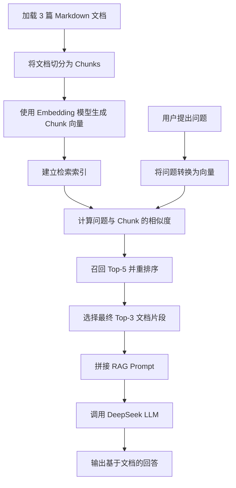

# 任务一：RAG 学习与完成指南

## 1. 任务一到底要做什么

根据 `homework_2.docx`，任务一要求实现一个最简单的 RAG 系统：

- 准备 3 篇知识库文档。
- 对文档内容进行向量化（Embedding）。
- 根据用户问题进行相似度检索。
- 将检索到的文档片段拼入 Prompt。
- 调用 LLM，生成基于文档内容的回答。

指定输入是：

> 什么是高速追尾事故？

期望输出是：

> 基于知识库文档，对高速追尾事故进行准确回答。

任务的核心不是让大语言模型直接回答问题，而是让模型先从指定文档中获得相关知识，再根据这些知识回答。

---

## 2. 什么是 RAG

RAG 全称是 **Retrieval-Augmented Generation**，中文通常称为“检索增强生成”。

普通 LLM 问答只有一个主要过程：

```text
用户问题 -> LLM -> 回答
```

RAG 在调用 LLM 前增加了知识检索过程：

```text
用户问题
   ↓
从知识库检索相关内容
   ↓
将相关内容和问题组合成 Prompt
   ↓
LLM 根据检索内容生成回答
```

RAG 解决的主要问题包括：

- LLM 不一定知道你的私有文档内容。
- LLM 的训练知识可能已经过时。
- LLM 可能生成听起来合理、实际错误的内容。
- 用户希望回答可以追溯到指定知识来源。

在本任务中，LLM 不需要提前训练高速追尾事故知识。系统会在回答前，从三篇事故知识文档中检索相关片段，并要求 LLM 仅根据这些片段回答。

---

## 3. 本项目的完整 RAG 流程

当前项目的主流程位于 `task1_main.py`，可以分为九个步骤。



### 步骤 1：加载知识库文档

系统从 `rag_docs_accident/` 加载三篇 Markdown 文档：

1. `doc1_定义与成因.md`
2. `doc2_应急处置与救援.md`
3. `doc3_法律责任与赔偿.md`

加载后，每篇文档不只是一个字符串，还会保存文件名和来源路径等元数据。

你需要理解：

- 知识库是 RAG 回答问题时的外部知识来源。
- 文档质量会直接影响最终回答质量。
- 元数据可以帮助系统展示答案来源，也可以参与检索。

### 步骤 2：将文档切分为 Chunk

系统不会直接拿整篇文档进行检索，而是先将文档切分为较小的文档块，即 Chunk。

当前配置为：

- 最大 Chunk 长度：500 字符。
- 相邻长文本 Chunk 重叠：50 字符。
- 优先按照 Markdown 二级、三级标题切分。

为什么需要切分：

- 整篇文档可能同时包含多个主题。
- 用户问题通常只与其中一小部分有关。
- 小型 Chunk 可以提高检索精度，并减少传给 LLM 的无关内容。

当前 Chunk 还保存了以下层级信息：

- `document_title`：文档标题。
- `parent_header`：父级标题。
- `current_header`：当前章节标题。
- `filename` 和 `source`：文件来源。

需要注意，Chunk 不是越小越好：

- 太大：包含无关信息，检索不够精准。
- 太小：上下文不足，LLM 难以理解完整含义。
- 合理切分需要在检索精度和上下文完整性之间平衡。

### 步骤 3：初始化 Embedding 模型

Embedding 的作用是把文本转换为数值向量。

例如，下面两句话文字不同，但含义接近：

- “追尾事故是什么意思？”
- “什么是高速追尾事故？”

Embedding 模型应该让它们在向量空间中的位置比较接近。

当前项目使用：

```text
paraphrase-multilingual-MiniLM-L12-v2
```

这是一个支持中文等多语言文本的 Sentence Transformers 模型。

你需要掌握：

- Embedding 向量是文本的语义表示，不是文本答案。
- 语义接近的文本，其向量通常也更接近。
- Embedding 模型负责检索，不负责生成最终回答。
- Embedding 模型与 DeepSeek LLM 承担不同职责。

### 步骤 4：建立检索索引

建立索引时，系统会对每个 Chunk 生成 Embedding 向量并保存。

当前项目用于向量化的内容包括：

```text
文档标题 + 父标题 + 当前标题 + Chunk 正文
```

加入标题层级的原因是：正文可能只写了具体内容，没有重复说明它属于“定义”“责任认定”还是“赔偿项目”。加入标题后，向量可以更完整地表达 Chunk 的主题。

索引建立完成后，系统获得两项核心数据：

- 原始 Chunk 列表。
- 每个 Chunk 对应的向量矩阵。

在大型生产系统中，通常会使用 FAISS、Milvus、Chroma 或其他向量数据库。当前作业数据量很小，因此使用 NumPy 直接计算已经足够。

### 步骤 5：初始化 DeepSeek LLM

当前项目通过统一的 OpenAI 风格接口调用 DeepSeek：

- API 地址：`https://api.deepseek.com`
- 模型：`deepseek-v4-pro`
- API Key：从 `.env` 中读取 `DEEPSEEK_API_KEY`

LLM 的职责不是检索文档，而是阅读已经检索到的内容，并生成完整、自然的回答。

不要将 API Key 直接写进 Python 文件或 Notebook。使用 `.env` 可以避免密钥被意外提交或分享。

### 步骤 6：接收用户问题

任务一的指定问题是：

```text
什么是高速追尾事故？
```

问题会同时用于：

- 在知识库中检索相关 Chunk。
- 与检索结果一起构造最终 Prompt。

### 步骤 7：检索相关 Chunk

检索时，系统首先将问题转换为向量，然后计算它与所有 Chunk 向量之间的余弦相似度。

#### 余弦相似度

余弦相似度用于衡量两个向量方向是否接近：

```text
相似度越高 -> 两段文本在语义上越相关
相似度越低 -> 两段文本在语义上越不相关
```

当前项目不是只使用向量分数，而是执行两阶段检索：

1. 按向量相似度召回 Top-5 候选 Chunk。
2. 使用向量分数和标题匹配分数进行重排序。
3. 选择最终 Top-3 传给 LLM。

最终分数计算方式：

```text
最终分数 = 85% × 向量相似度 + 15% × 标题字符二元组匹配度
```

三种分数的意义：

- **向量分数**：问题和 Chunk 整体语义是否接近。
- **标题分数**：问题中的关键词是否与章节标题匹配。
- **最终分数**：融合两类信号后的排序依据。

标题分数可以帮助解决一种常见问题：某段正文确实包含答案，但由于正文没有重复章节主题，纯向量检索没有将它排到前面。

### 步骤 8：构造 RAG Prompt 并调用 LLM

检索完成后，系统会把最终 Top-3 Chunk 和用户问题组合成 Prompt。

Prompt 的结构大致如下：

```text
请根据以下文档内容回答问题。

文档片段 1：……
文档片段 2：……
文档片段 3：……

问题：什么是高速追尾事故？

请仅根据文档内容回答。
```

这一步很重要，因为 Prompt 决定了 LLM：

- 能看到哪些证据。
- 应该回答什么问题。
- 是否允许使用文档外知识。
- 当文档没有答案时应该如何处理。

RAG 的最终回答质量不仅取决于 LLM，也取决于检索结果和 Prompt 是否合理。

### 步骤 9：输出最终回答

DeepSeek 阅读问题和检索到的文档片段后，生成最终回答。

当前主问题的回答能够准确说明：

> 高速公路追尾事故是指在同一条车道上，后车车头与前车车尾发生碰撞的交通事故。

这表示系统完成了最基本的 RAG 闭环：

```text
知识库 -> 检索 -> Prompt -> LLM -> 基于知识库的回答
```

---

## 4. 作业最低要求与当前增强实现

### 作业最低要求

完成以下内容，就满足任务一的基本要求：

- 有三篇知识库文档。
- 可以将文档转换为向量。
- 可以根据问题检索相似文档片段。
- 可以把检索结果拼接到 Prompt。
- 可以调用 LLM 并生成基于文档的回答。

### 当前项目额外完成的增强

当前项目已经超过最低要求，还实现了：

- 按 Markdown 标题层级切分文档。
- 为 Chunk 保存文档标题、父标题和当前标题。
- 使用标题层级增强 Embedding 输入。
- Top-5 候选召回后进行二次重排序。
- 同时显示向量分数、标题分数和最终分数。
- 使用四个测试问题评估检索质量。
- 生成 Chunk 分布、相似度热图和重排序分数图。

这些增强不是完成最简单 RAG 的硬性要求，但可以证明你理解了如何分析和优化检索效果。

---

## 5. 你需要重点掌握的知识

### 5.1 必须真正理解的核心概念

你应该能够不用看代码，清楚回答以下问题：

1. RAG 是什么，它与直接调用 LLM 有什么区别？
2. 为什么要先切分文档，而不是直接检索整篇文档？
3. Embedding 是什么，为什么可以用于语义检索？
4. Embedding 模型和 LLM 的职责有什么不同？
5. 如何判断问题与 Chunk 是否相关？
6. Top-K 是什么，设置过大或过小会有什么影响？
7. 为什么要把检索结果放入 Prompt？
8. 为什么要求 LLM 仅根据文档回答？
9. 如果最终答案错误，应该如何判断是检索问题还是生成问题？

### 5.2 需要能够解释的项目参数

| 参数 | 当前值 | 作用 |
|---|---:|---|
| `chunk_size` | 500 | 控制单个 Chunk 的最大长度 |
| `chunk_overlap` | 50 | 长文本切分时保留部分相邻上下文 |
| `candidate_k` | 5 | 向量检索阶段召回的候选数量 |
| `top_k` | 3 | 最终传入 LLM 的 Chunk 数量 |
| 向量权重 | 85% | 强调整体语义相似度 |
| 标题权重 | 15% | 补充章节标题关键词信号 |

你不需要认为这些数值永远正确。它们是当前知识库上的合理选择，可以通过评估结果继续调整。

### 5.3 需要具备的调试能力

当系统回答错误时，应按以下顺序检查：

1. **知识库是否有答案**  
   如果文档本身没有答案，RAG 无法生成可靠回答。

2. **文档是否正确加载和切分**  
   检查相关内容是否被切坏、遗漏或与其他主题混合。

3. **相关 Chunk 是否被召回**  
   查看 Top-5 和 Top-3 中是否包含期望章节。

4. **Prompt 是否包含正确证据**  
   检索正确但 Prompt 漏掉内容，也会导致回答失败。

5. **LLM 是否遵循文档**  
   如果证据正确但回答错误，问题更可能在 Prompt 或 LLM 生成阶段。

这个排查顺序非常重要。不能只看最终答案，也不能一出现错误就立即更换 LLM。

---

## 6. 如何理解当前可视化和评估

Notebook 主流程后面的附录用于分析效果，不属于最基本的 RAG 执行步骤。

### Chunk 长度与文档分布图

这张图用于检查：

- Chunk 是否普遍太长或太短。
- 三篇文档是否都被正常切分。
- 是否有某篇文档产生异常多或异常少的 Chunk。

它反映的是数据准备和切分质量，不直接表示检索是否准确。

### 问题 × Chunk 相似度热图

热图中：

- 每一行代表一个测试问题。
- 每一列代表一个 Chunk。
- 颜色越深，代表向量相似度越高。

理想情况是：不同问题会在其对应主题的 Chunk 上形成明显高分区域。

例如：

- “什么是高速追尾事故？”应对定义章节颜色更深。
- “责任如何认定？”应对责任认定章节颜色更深。
- “赔偿项目有哪些？”应对赔偿章节颜色更深。

热图不能证明 LLM 最终回答一定正确，但可以帮助观察 Embedding 和检索是否能区分不同主题。

### 重排序分数图

该图比较：

- 向量分数。
- 标题分数。
- 最终综合分数。

通过它可以解释某个 Chunk 为什么进入最终 Top-3，以及标题信号是否改变了原始向量排序。

### Hit@3、Recall@5 和 MRR

当前四个测试问题的结果为：

- `Hit@3 = 100%`
- `Recall@5 = 100%`
- `MRR = 0.875`

指标含义：

- **Hit@3**：期望章节是否出现在最终前三名。100% 表示四个问题全部命中。
- **Recall@5**：期望章节是否出现在候选前五名。100% 表示候选召回没有漏掉目标章节。
- **MRR**：期望章节首次出现排名的倒数平均值。越接近 1，表示正确章节越常排在第一名。

指标良好只能说明当前测试问题上的检索效果良好。它不能保证系统面对所有新问题都能正确回答。

---

## 7. 如何判断任务一已经完成

不能只用“程序运行成功”判断任务完成。运行成功只能说明代码没有立即报错，完整验收还应包括以下内容。

### 功能验收

- 成功加载三篇知识库文档。
- 成功生成多个 Chunk。
- 成功构建向量索引。
- 指定问题可以检索到定义章节。
- Prompt 中包含相关文档内容。
- DeepSeek 成功生成回答。
- 最终回答与知识库内容一致。

### 质量验收

- 主问题的 Top-1 命中定义章节。
- 责任、应急、赔偿等测试问题能召回对应章节。
- 回答没有明显使用文档中不存在的信息。
- 检索结果可以展示来源和分数。

### 工程验收

- API Key 存放在 `.env`，没有硬编码。
- Notebook 与 `task1_main.py` 调用同一套真实模块。
- Notebook 可以从头运行完成。
- 核心 RAG 流程与可选分析附录清楚分离。

按照这些标准，当前任务一已经形成了完整且可演示的 RAG 系统。

---

## 8. 答辩时应该如何介绍

可以按下面的逻辑进行介绍：

### 第一部分：任务目标

> 本任务要求基于三篇高速公路追尾事故文档，实现一个最小 RAG 系统，使大语言模型能够先检索相关知识，再基于知识库回答“什么是高速追尾事故？”。

### 第二部分：系统流程

> 系统首先加载三篇 Markdown 文档，并按标题层级切分为 Chunk。然后使用多语言 Embedding 模型将 Chunk 转换为向量并建立索引。用户提问后，系统计算问题与 Chunk 的相似度，召回候选内容并进行重排序，最终把 Top-3 文档片段与问题拼接为 Prompt，交给 DeepSeek 生成回答。

### 第三部分：当前优化

> 为减少相关章节漏召回，系统在 Embedding 时加入文档标题和章节标题，并使用 85% 向量相似度与 15% 标题匹配度进行重排序。

### 第四部分：效果验证

> 主问题的第一条检索结果命中定义章节。四个测试问题的 Hit@3 和 Recall@5 均达到 100%，说明当前知识库上的目标章节能够稳定进入候选和最终检索结果。

### 第五部分：局限性

> 当前知识库规模较小，使用 NumPy 即可完成检索。测试问题数量有限，因此指标不能代表所有真实问题。后续可以扩展知识库、增加测试集，并使用向量数据库或更强的重排序模型。

---

## 9. 建议的学习顺序

不要先背全部代码。建议按以下顺序学习：

1. 理解 RAG 与直接调用 LLM 的区别。
2. 理解 Document、Chunk 和元数据的作用。
3. 理解为什么要切分文档，以及 Chunk 大小的影响。
4. 理解 Embedding、向量和余弦相似度。
5. 理解 Top-K 召回和重排序。
6. 理解如何将检索证据拼入 Prompt。
7. 学会判断错误来自检索还是生成。
8. 学会使用 Hit@3、Recall@5、MRR 和热图分析检索效果。
9. 最后再阅读 `task1_main.py` 和 `src/rag/` 中的具体实现。

---

## 10. 最终掌握检查表

完成学习后，你应该能够做到：

- [ ] 用自己的话解释什么是 RAG。
- [ ] 画出本任务从知识库到最终回答的完整流程。
- [ ] 解释为什么需要 Chunk。
- [ ] 解释 Embedding 模型与 DeepSeek LLM 的区别。
- [ ] 解释余弦相似度和 Top-K 检索。
- [ ] 解释当前项目为什么加入标题层级信息。
- [ ] 解释向量分数、标题分数和最终分数。
- [ ] 阅读检索输出并判断是否命中正确章节。
- [ ] 解释 Hit@3、Recall@5、MRR 和热图。
- [ ] 在回答错误时按步骤定位问题。
- [ ] 独立运行 `task1_main.py` 和 `rag_pipeline_demo.ipynb`。
- [ ] 清楚区分作业最低要求和当前项目的增强功能。

如果你能够完成以上检查表，就不仅是“让代码运行成功”，而是真正理解并完成了任务一。
